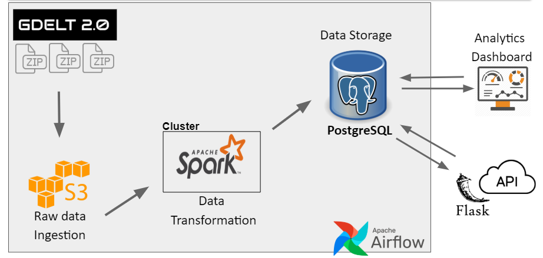

# Data Warehouse Solution (DWS)

# Table of Contents
1. [Introduction](README.md#introduction)
2. [Approach](README.md#approach)
3. [Requirements](README.md#requirements)
4. [Running the Pipeline](README.md#running-the-pipeline)
5. [Author](README.md#author)

# Introduction
This project aims to create a simple and cost-conscious solution for collecting, managing and analyzing large datasets, so that data analysts can discover, visualize and present their findings without much effort.

I used [GDELT](https://www.gdeltproject.org/data.html) data set as the primary source of data for my data warehouse.


# Approach

1. Extract the raw data into AWS S3
2. Perform raw data transformations with Apache Spark run on EC2 cluster
3. Store tansformed data in PostgreSQL database
4. Retrieve and visualize data via analytics Tableau dashboard (ex.: Tableau) or access the data through web API
5. Airflow orchestration of pipeline and daily updates with new GDELT events data

# Requirements
Languages:
* Python 3.5

Technologies:
* Apache Spark
* PostgreSQL
* Flask

Third-Party Dependencies:
* AWS CLI
* See the [Dependencies File](data/../docs/3rd_party_dependencies.txt) for a complete list of libraries required.


# Running the Pipeline:
#### Configure AWS
```bash
aws configure
```

#### Set-up AWS:
Configure a Virtual Private Cloud (VPC) with a security group and subnet.

#### Setup the ENV environment file
All project's processes rely on environment variables. It will also be distriubted to the cluster, so the cluster knows the Postgres server information.

#### Download the data:
SSH into the master node (EC2) instance and run:
```bash
bash ./ingestion/run_download.sh
```

#### Spin up the Spark cluster:
Start a cluster using the open-source tool [Pegasus](https://github.com/InsightDataScience/pegasus).
Configure the master and workers nodes yaml files under ./vars/spark_cluster. Ex. the master file:
```yaml
purchase_type: on_demand
subnet_id: subnet-XXXX
num_instances: 1
key_name: XXXXX-keypair
security_group_ids: sg-XXXXX
instance_type: m4.large
tag_name: spark-cluster
vol_size: 100
role: master
use_eips: true
```

#### Running the Spark cluster:
SSH into the master node and run:
```bash
peg ssh spark-cluster 1
```
 
If you need to terminate your SSH connection, but leave the application process running You would need to detach your process from the terminal first and then put it in the background. This can be achieved with Unix '[screen](https://ss64.com/bash/screen.html)' utility:
```bash
screen
```
HINT: Use Ctrl + 'a' + 'd' to detach the process and continue its execution as a background process.

To start the data transformation process using Spark run:
```bash
bash ./spark/run_spark.sh
```

#### Running the PostgreSQL database server:
SSH into the flask server and run:
```bash
bash ./postgres/run_postgres.sh
```

#### Running the web API flask server:
SSH into the flask server and run:
```bash
bash ./web_api/run_api.sh
```

#### Running the frontend flask server:
SSH into the flask server and run:
```bash
bash ./frontend/run_frontend.sh
```

# Author
Created by Artsiom Sinitski