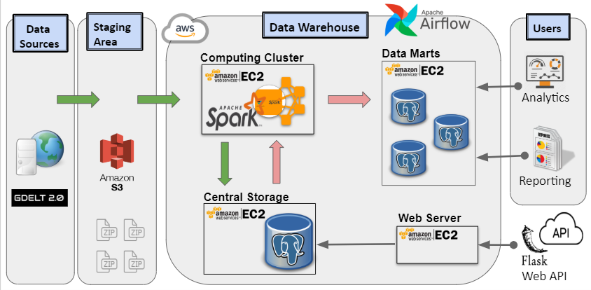
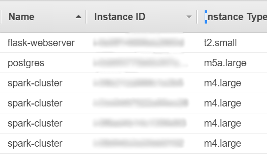

# DWS (Data Warehouse Solution)


# Table of Contents
1. [Introduction](README.md#introduction)
2. [Data Sources](README.md#data-sources)
3. [Approach](README.md#approach)
4. [Project Structure](README.md#project-folder-structure)
5. [Installation Requirements](README.md#installation-requirements)
6. [Infrastructure setup](README.md#infrastructure-setup)
7. [Running the Pipeline](README.md#running-the-pipeline)
8. [Author](README.md#author)

# Introduction
This project aims to create a simple and cost-conscious data warehouse solution for collecting, managing and analyzing the GDELT dataset, so that data analysts can discover, visualize and present their findings with ease. More detailed DWS project presentation can be viewed [here](docs/DWS_Presentation.pdf).


# Data Sources
The [GDELT](https://www.gdeltproject.org/data.html) data set is the primary source of raw data.


# Approach

 The DWS solution is designed according to the Layered Scallable Architechture (LSA):
* Primary (Staging) Data layer
* Core Data layer
* Data Marts layer
* Service layer

All of the the Data Warehouse insfrustructure is hosted in the AWS cloud. The “Staging Area” uses AWS S3 object store to accumalate the raw data files. All DWS servers are run on AWS EC2 instances:
* Web server (Flask)
* Apache Spark cluster nodes
* Central Storage and Data Mart databases

Currently, there are 2 separate ETL processes that provide data movement within the DWS solution.

Central Storage ETL (green arrows) connects the Staging and Core data layers and performs the following work:
  1. Extract the raw data into AWS S3 object storage (staging area).
  2. Enforce the GDELT schema onto the raw data using Apache Spark distributed computing engine (run on EC2 cluster).
  3. Store tansformed data in the Central Storage (PostgreSQL database).
   
Data Mart ETL (red arrows) connects the Core and Data Mart layers and performs the following work:
  1. Retrieve the structured data from the Central Storage and load into the Spark engine.
  2. Model the data to comply with the Star schema used in the Data Mart. The Star Schema enables faster and easier and more specialized data analysis due to relativley small size fo the data set stored.
  3. Load tansformed data into the Data Mart (PostgreSQL database).

Data Marts will pull a subset of data from the Central Storage (ex: events related to protests only). These subsets are much smaller in size and thus, the speed of performing data retrival is much greater. Datamart data model is defined by the **[Star](/docs/DWS_datamart_schema.png) schema**, where dataset is broken down into separate 'Fact' and 'Dimentions' table.
Further data analysis and visualization can be done via analytics dashboard (ex: Tableau) that can be connected to Datamarts.

Also, it is possible to access the Central Storage data directly through the Web API.

Daily updates of the current GDELT data are downloaded and combined with the historical data in the Central Storage and Data Marts by the Apache Airflow workflow orchestration engine during the times when business activities are minimal.


# Installation Requirements
Programming Languages:
* Python 3.6+
* Bash

Technologies:
* Amazon Web Services (AWS)
* Apache Airflow
* Apache Spark
* PostgreSQL
* Flask

Third-Party Dependencies:
* AWS CLI
* See the [Dependencies List](docs/3rd_party_dependencies.txt) for the libraries required
* Refer to the [Installation Instructions](docs/install_instructions.md) for more details


# Project Folder Structure

* /airflow - Airflow scheduler scripts to run the DWS data update job daily
* /data - directory where the masterfilelist.txt is downloaded
* /datamart - contains psql script to setup datamart database
* /docs - contains media resources and text for the README file
* /frontend - scripts to run the project demo webpage (no longer accessible)
* /ingestion - scripts to run raw data download from the GDELT web site
* /postgres - scripts to start database server
* /spark - scripts to run Spark computations and data transformations
* /web_api - scripts to start the flask webserver for serving the web API

# Infrastructure setup
I used 6 AWS EC2 instances for my project:


* Spark Cluster (4 nodes) - Spark master and slave nodes & Airflow scheduler (on master node)
* Databases Server (1 node) - Central Storage and Data Marts PostgreSQL nodes
* Flask Webserver (1 node) - Web API & demo frontend

# Running the Pipeline
#### Configuring AWS
```bash
aws configure
```

#### Setting up AWS
Configure a Virtual Private Cloud (VPC) with necessary Security Groups and Subnet.

#### Setting up the ENV environment file
Quite a few project's processes rely on environment variables. It will also be distriubted to the cluster, so the cluster knows the Postgres server information.

#### Setting up the Central Storage and Data Marts databases
There is no need to manually create tables in the Central Storage database, as this is done automatically during the very first time raw GDELT data is transferred there. However, ensure to run any psql scripts (to create necessary indecies, etc.) found in './postgres' folder beforehand.
To create 'Fact' and 'Dimentions' tables in the Datamart database run the 'datamart_db_setup.psql' found in ./datamart folder.
SSH into the Datamart database node instance, login into psql console:
```psql
#postgres> \i ./datamart/datamart_db_setup.psql
```

#### Downloading the raw GDELT data (Ingestion step)
SSH into the master node (EC2) instance and run:
```bash
bash ./ingestion/run_download.sh [--schedule | --manual]
```
    '--schedule' option is used by Airflow to process the daily data deltas stored in their separate tables
  
    '--manual' option will start downloading all of the GDELT data from the website (most likely this not a
               good option to use after the ingestion step was run for the very first time)

#### Spinning up the Spark cluster
Start a cluster using the open-source tool [Pegasus](https://github.com/InsightDataScience/pegasus).
Configure the master and workers nodes yaml files under ./vars/spark_cluster. Ex. the master file:
```yaml
purchase_type: on_demand
subnet_id: subnet-XXXX
num_instances: 1
key_name: XXXXX-keypair
security_group_ids: sg-XXXXX
instance_type: m4.large
tag_name: spark-cluster
vol_size: 100
role: master
use_eips: true
```

#### Running the Spark cluster (Transformation & Load step)
SSH into the master node and run:
```bash
peg ssh spark-cluster 1
```
 
If you need to terminate your SSH connection, but leave the application process running You would need to detach your process from the terminal first and then put it in the background. This can be achieved with Unix '[screen](https://ss64.com/bash/screen.html)' utility:
```bash
screen
```
HINT: Use Ctrl + 'a' + 'd' to detach the process and continue its execution as a background process.

To start the Central Storage ETL process run:
```bash
bash ./spark/run_centralstorage_etl.sh  [--schedule | --manual]
```
To start the Datamart ETL process run:
```bash
bash ./spark/run_datamart_etl.sh  [--schedule | --manual]
```

#### Running the PostgreSQL database server
SSH into the flask server and run:
```bash
bash ./postgres/run_postgres.sh
```

#### Running the Airflow process
SSH into the Spark master node and run:
```bash
bash ./airflow/run_batch_scheduler.sh
```

#### Running the web API flask server
SSH into the web API instance and run:
```bash
bash ./web_api/run_api.sh
```

#### Running the frontend flask server
SSH into the frontend instance and run:
```bash
bash ./frontend/run_frontend.sh
```

# Author
Created by Artsiom Sinitski