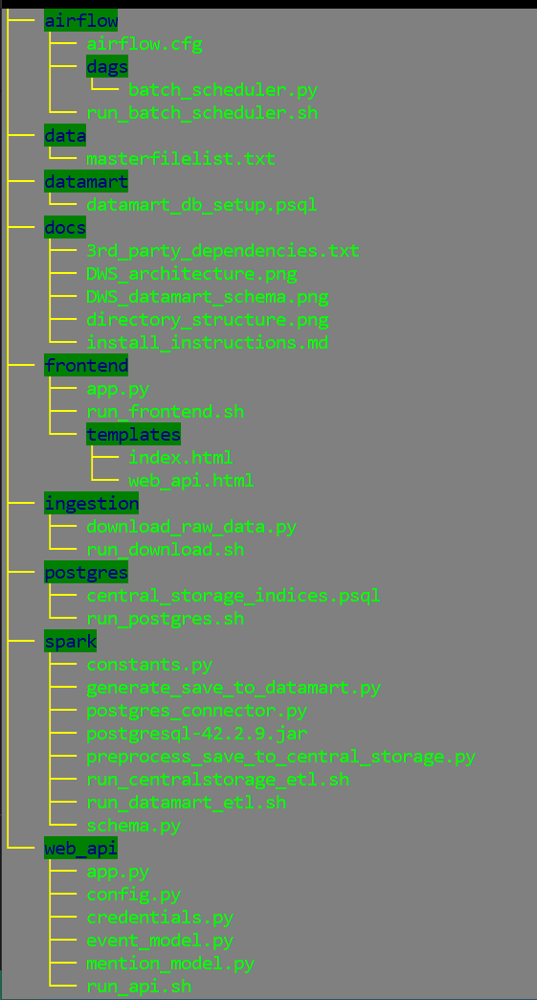

# DWS (Data Warehouse Solution)


# Table of Contents
1. [Introduction](README.md#introduction)
2. [Data Sources](README.md#data-sources)
3. [Approach](README.md#approach)
4. [Project Structure](README.md#project-folder-structure)
5. [Requirements](README.md#requirements)
6. [Cluster Structure](README.md#cluster-structure)
7. [Running the Pipeline](README.md#running-the-pipeline)
8. [Author](README.md#author)

# Introduction
This project aims to create a simple and cost-conscious data warehouse solution for collecting, managing and analyzing the GDELT dataset, so that data analysts can discover, visualize and present their findings with ease.


# Data Sources
I used the [GDELT](https://www.gdeltproject.org/data.html) data set as the primary source of data for my data warehouse.


# Approach

The latest trends in technology influenced my decison to host the Data Warehouse insfrustructure in the AWS cloud. The DWS solution is built using the principles of Layered Scallable (LSA) architechture:
* Primary (Staging) Data layer
* Core Data layer
* Data Mart layer
* Service layer (to be developed...)
  
Currently, there are 2 separate ETL processes that provide data movement within the DWS solution.
ETL #1 connects the Staging and Core data layers and performs the following work:
  1. Extract the raw data into AWS S3 object storage (staging area).
  2. Enforce the GDELT schema onto the raw data using Apache Spark distributed computing engine (run on EC2 cluster).
  3. Store tansformed data in the Central Storage (PostgreSQL database).
   
ETL #2 connects the Core and Data Mart layers and  performs the following work:
  1. Retrieve the structured data from the Central Storage and load into the Spark engine.
  2. Model the data to comply with the Star schema used in the Data Mart. The Star Schema enables faster and easier and more specialized data analysis due to relativley small size fo the data set stored.
  3. Load tansformed data into the Data Mart (PostgreSQL database).
   
Data analysis and visualization is done via analytics dashboard (ex.: Tableau). Also, it is possible to access the data through the web API.
Daily updates of the GDELT data for the Central Storage and Data Mart are handled by the Apache Airflow workflow orchestration engine during the times when business activities are minimal.

# Requirements and Installation steps
Programming Languages:
* Python 3.6+

Technologies:
* Amazon Web Services (AWS)
* Apache Airflow
* Apache Spark
* PostgreSQL
* Flask

Third-Party Dependencies:
* AWS CLI
* See the [Dependencies List](docs/3rd_party_dependencies.txt) for the libraries required
* Refer to the [Installation Instructions](docs/install_instructions.md) for more details


# Project Folder Structure

* /airflow - Airflow scheduler scripts to run the DWS data update job daily
* /docs - contains resources for the README file
* /frontend - scripts necessary to run the demo webpage
* /ingestion - scripts to download raw data from the GDELT web site
* /postgres - scripts to start database server
* /spark - scripts to start Spark data transformations
* /web_api - scripts to start the flask webserver to serve the web API

# Cluster Structure
For my project I used 6 AWS EC2 instances:


* Spark Cluster (4 nodes) - Data preprocessing & Airflow scheduler
* Database Server (1 node) - PostgreSQL
* Flask Webserver (1 node) - Web API & demo frontend

# Run the Pipeline
#### Configuring AWS
```bash
aws configure
```

#### Setting up AWS
Configure a Virtual Private Cloud (VPC) with necessary Security Groups and Subnet.

#### Setting up the ENV environment file
Quite a few project's processes rely on environment variables. It will also be distriubted to the cluster, so the cluster knows the Postgres server information.

#### Downloading the raw GDELT data (Ingestion step)
SSH into the master node (EC2) instance and run:
```bash
bash ./ingestion/run_download.sh [--schedule | --manual]
```

#### Spinning up the Spark cluster
Start a cluster using the open-source tool [Pegasus](https://github.com/InsightDataScience/pegasus).
Configure the master and workers nodes yaml files under ./vars/spark_cluster. Ex. the master file:
```yaml
purchase_type: on_demand
subnet_id: subnet-XXXX
num_instances: 1
key_name: XXXXX-keypair
security_group_ids: sg-XXXXX
instance_type: m4.large
tag_name: spark-cluster
vol_size: 100
role: master
use_eips: true
```

#### Running the Spark cluster (Transformation & Load step)
SSH into the master node and run:
```bash
peg ssh spark-cluster 1
```
 
If you need to terminate your SSH connection, but leave the application process running You would need to detach your process from the terminal first and then put it in the background. This can be achieved with Unix '[screen](https://ss64.com/bash/screen.html)' utility:
```bash
screen
```
HINT: Use Ctrl + 'a' + 'd' to detach the process and continue its execution as a background process.

To start the data transformation process using Spark run:
```bash
bash ./spark/run_spark.sh  [--schedule | --manual]
```

#### Running the PostgreSQL database server
SSH into the flask server and run:
```bash
bash ./postgres/run_postgres.sh
```

#### Running the Airflow process
SSH into the Spark master node and run:
```bash
bash ./airflow/batch_scheduler.sh
```

#### Running the web API flask server
SSH into the web API instance and run:
```bash
bash ./web_api/run_api.sh
```

#### Running the frontend flask server
SSH into the frontend instance and run:
```bash
bash ./frontend/run_frontend.sh
```

# Author
Created by Artsiom Sinitski